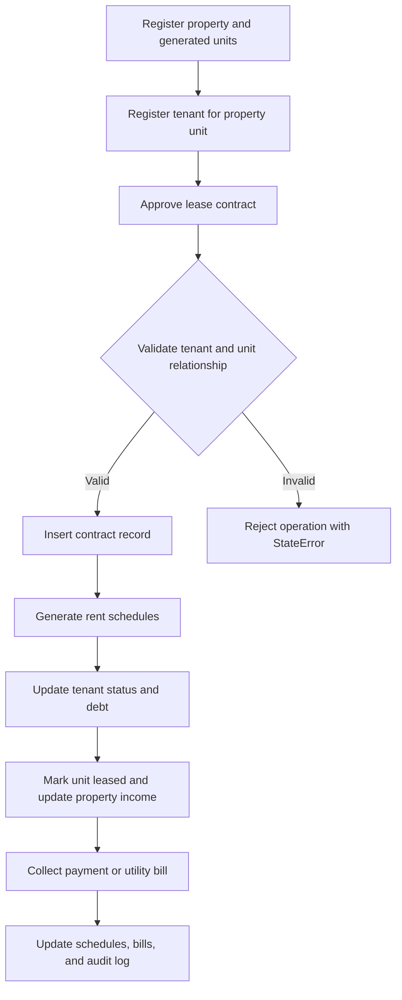
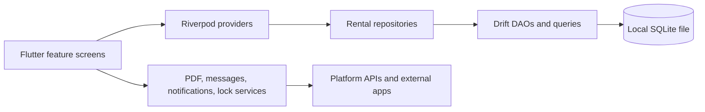
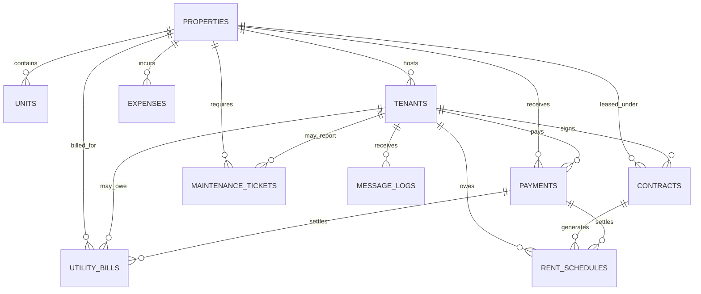

## Table of Contents | فهرس المحتويات

- [Milaak | مِلاك](#milaak--ملاك)
- [Overview | نظرة عامة](#overview--نظرة-عامة)
- [Quick Start | بدء سريع](#quick-start--بدء-سريع)
- [Quick Facts | حقائق سريعة](#quick-facts--حقائق-سريعة)
- [Why This Project? | لماذا هذا المشروع؟](#why-this-project--لماذا-هذا-المشروع)
- [System Scope | نطاق النظام](#system-scope--نطاق-النظام)
- [Screenshots | لقطات الشاشة](#screenshots--لقطات-الشاشة)
- [Key Features | الميزات الرئيسية](#key-features--الميزات-الرئيسية)
- [Module Overview | نظرة عامة على الوحدات](#module-overview--نظرة-عامة-على-الوحدات)
- [System Workflow | سير العمل](#system-workflow--سير-العمل)
- [Engineering Highlights | نقاط الإبداع والتميز](#engineering-highlights--نقاط-الإبداع-والتميز)
- [Technology Stack](#technology-stack)
- [Architecture Overview | نظرة عامة على المعمارية](#architecture-overview--نظرة-عامة-على-المعمارية)
- [Engineering Decisions | قرارات هندسية](#engineering-decisions--قرارات-هندسية)
- [Performance Considerations | اعتبارات الأداء](#performance-considerations--اعتبارات-الأداء)
- [Technical Challenges | التحديات التقنية](#technical-challenges--التحديات-التقنية)
- [UI/UX Design](#uiux-design)
- [Installation & Configuration | التثبيت والإعداد](#installation--configuration--التثبيت-والإعداد)
- [Project Structure](#project-structure)
- [Services Provided](#services-provided)
- [API Overview](#api-overview)
- [Database Overview | نظرة عامة على قاعدة البيانات](#database-overview--نظرة-عامة-على-قاعدة-البيانات)
- [Security | الأمان](#security--الأمان)
- [Testing](#testing)
- [Deployment | النشر](#deployment--النشر)
- [Roadmap | خارطة الطريق](#roadmap--خارطة-الطريق)
- [Development Team](#development-team)

---

<div align="center">


# Milaak | مِلاك

**Local-first Arabic property and rental management mobile app**


</div>

> **Hero view — Rental operations dashboard**
>
> [](<نماذج صور التطبيق/IMG-20260617-WA0000.jpg>)
>
> A mobile-first Arabic interface for monitoring property occupancy, collections, arrears, and contract activity.

---

## Overview | نظرة عامة

🇺🇸 **English**

Milaak is an Arabic-first mobile application for local property and rental management. It helps individual landlords and small property offices organize properties, units, tenants, contracts, rent schedules, payments, service bills, maintenance tickets, documents, reminders, and financial reports from one offline-capable workspace. The application keeps core data on the device through SQLite and focuses on day-to-day rental operations without requiring a cloud account for the primary workflow.

🇸🇦 **العربية**

مِلاك تطبيق جوال عربي لإدارة العقارات والإيجارات محليا. يساعد أصحاب العقارات والمكاتب العقارية الصغيرة على تنظيم العقارات والوحدات والمستأجرين والعقود وجداول الإيجار والسندات وفواتير الخدمات والصيانة والمرفقات والتنبيهات والتقارير المالية من مساحة عمل واحدة. يعتمد التطبيق على SQLite لحفظ البيانات الأساسية على الجهاز ويركز على التشغيل اليومي دون اشتراط حساب سحابي للمسار الرئيسي.

---

## Quick Start | بدء سريع

🇺🇸 **English**

The project is a Flutter application targeting Android and iOS. It does not require a remote database for local development because the app creates its Drift/SQLite database on the device or emulator.

🇸🇦 **العربية**

المشروع تطبيق Flutter يستهدف Android و iOS. لا يحتاج إلى قاعدة بيانات بعيدة أثناء التطوير المحلي، لأن التطبيق ينشئ قاعدة Drift/SQLite على الجهاز أو المحاكي.

```bash
git clone https://github.com/alhetarahmed83-collab/milaak_flutter.git
cd milaak_flutter
flutter pub get
# No .env file is required by the current codebase.
flutter run
```

For full setup details, see [Installation & Configuration](#installation--configuration--التثبيت-والإعداد).

---

## Quick Facts | حقائق سريعة

| Item | Value |
| --- | --- |
| Project type | Mobile property and rental management application |
| Architecture | Flutter modular feature structure with repository-based local data access |
| Frontend | Flutter, Material 3, Arabic RTL UI, light/dark themes |
| Backend | Application-owned local service and repository layer; no application REST backend is exposed |
| Database | Local SQLite through Drift |
| Deployment | `[ضع رابط النشر الحي هنا]` |
| License | MIT |

---

## Why This Project? | لماذا هذا المشروع؟

🇺🇸 **English**

Rental operations create connected records: a property contains units, a tenant occupies a unit, a contract creates rent schedules, a payment reduces debt, and service or maintenance activity affects the operational picture. Milaak addresses this by keeping rental workflows inside one local system rather than scattering records across paper notes, spreadsheets, and message threads. The approach fits small offices and individual landlords that need privacy, Arabic usability, and fast access to core records on a mobile device.

🇸🇦 **العربية**

عمليات الإيجار مترابطة بطبيعتها: العقار يحتوي وحدات، والمستأجر يشغل وحدة، والعقد ينشئ استحقاقات، والسداد يخفض المديونية، وفواتير الخدمات أو الصيانة تغير الصورة التشغيلية. يعالج مِلاك ذلك بجمع هذه المسارات داخل نظام محلي واحد بدلا من توزيعها بين أوراق وجداول ورسائل. هذا النهج مناسب للمكاتب الصغيرة وأصحاب العقارات الذين يحتاجون إلى خصوصية وتجربة عربية ووصول سريع إلى السجلات الأساسية عبر الجوال.

---

## System Scope | نطاق النظام

🇺🇸 **English**

- **Property portfolio:** properties, owners, floors, units, shops, unit states, expected rent, and service-meter policies.
- **Tenant operations:** tenant files, contact data, national ID fields, balances, deposits, account statements, reminders, and message history.
- **Contracts and rent schedules:** contract approval, lease period, payment frequency, custom terms, renewals, termination, and generated rent schedules.
- **Collections and documents:** payments, receipt numbers, due schedules, utility bill settlement, tenant/property/dashboard PDF reports, and share flows.
- **Services and maintenance:** electricity, water, gas, owner/tenant/shared meters, proof paths, external payments, maintenance tickets, cost tracking, and responsibility flags.
- **Administration:** office settings, currency, theme mode, backup export, backup file selection, local device lock testing, attachments, and audit log review.

🇸🇦 **العربية**

- **محفظة العقارات:** العقارات، الملاك، الأدوار، الوحدات، المحلات، حالات الوحدات، الإيجار المتوقع، وسياسات عدادات الخدمات.
- **عمليات المستأجرين:** ملفات المستأجرين، بيانات التواصل، رقم الهوية، الأرصدة، التأمين، كشف الحساب، التذكيرات، وسجل الرسائل.
- **العقود والاستحقاقات:** اعتماد العقود، مدة الإيجار، دورية الدفع، الشروط الخاصة، التجديد، الإنهاء، وإنشاء جداول الإيجار.
- **التحصيل والمستندات:** المدفوعات، أرقام السندات، الاستحقاقات، تسوية فواتير الخدمات، تقارير PDF، ومسارات المشاركة.
- **الخدمات والصيانة:** الكهرباء والماء والغاز، عدادات المالك والمستأجر والمشتركة، إثباتات السداد، الدفع الخارجي، بلاغات الصيانة، التكلفة، وتحديد المسؤولية.
- **الإدارة:** إعدادات المكتب، العملة، السمة، تصدير النسخ الاحتياطي، اختيار ملف نسخة احتياطية، اختبار قفل الجهاز، المرفقات، ومراجعة سجل النشاط.

---

## Screenshots | لقطات الشاشة

🇺🇸 **English**

Select any image to view it at full size. Current sample captures are available in `نماذج صور التطبيق/`. Final marketing screenshot paths are reserved under `assets/marketing/screenshots/`.

🇸🇦 **العربية**

اضغط على أي صورة لعرضها بالحجم الكامل. توجد نماذج الصور الحالية في `نماذج صور التطبيق/`. مسارات اللقطات النهائية محجوزة داخل `assets/marketing/screenshots/`.

### Mobile Experience | تجربة الجوال

| Mobile sample 1 | Mobile sample 2 | Mobile sample 3 |
| --- | --- | --- |
| [](<نماذج صور التطبيق/IMG-20260617-WA0001.jpg>)<br><sub>Mobile — Arabic rental workflow sample</sub> | [](<نماذج صور التطبيق/IMG-20260617-WA0002.jpg>)<br><sub>Mobile — property management interface sample</sub> | [](<نماذج صور التطبيق/IMG-20260617-WA0003.jpg>)<br><sub>Mobile — operational screen sample</sub> |

| Mobile sample 4 | Mobile sample 5 |
| --- | --- |
| [](<نماذج صور التطبيق/IMG-20260617-WA0004.jpg>)<br><sub>Mobile — Arabic UI sample</sub> | [](<نماذج صور التطبيق/IMG-20260617-WA0005.jpg>)<br><sub>Mobile — rental operations sample</sub> |

### Reserved Final Screenshots | لقطات نهائية محجوزة

📸 *Screenshot: dashboard — place image at: assets/screenshots/dashboard.png*

📸 *Screenshot: properties — place image at: assets/screenshots/properties.png*

📸 *Screenshot: tenants — place image at: assets/screenshots/tenants.png*

📸 *Screenshot: contracts — place image at: assets/screenshots/contracts.png*

📸 *Screenshot: payments — place image at: assets/screenshots/payments.png*

📸 *Screenshot: reports — place image at: assets/screenshots/reports.png*

---

## Key Features | الميزات الرئيسية

🇺🇸 **English**

- 🏢 **Property and unit management:** records buildings, floors, shops, unit numbers, occupancy state, expected rent, and service-meter configuration.
- 👥 **Tenant files:** keeps tenant contact data, linked property/unit, deposit, debt, open utility bills, maintenance tickets, payments, and message history together.
- 📄 **Contract workflow:** approves lease contracts, validates tenant-property consistency, creates rent schedules, updates unit occupancy, and supports termination.
- 💰 **Payments and receipts:** records rent and utility payments, generates receipt numbers, updates schedules and debts inside transactions, and supports PDF sharing.
- 📊 **Financial reporting:** summarizes expected income, collected payments, arrears, expenses, net income, and occupancy with chart support.
- 🔔 **Messaging and reminders:** renders Arabic templates for receipts, rent reminders, late payment notices, contract expiry, renewals, and utility messages.
- 🧰 **Services and maintenance:** handles utility bills, shared-meter distribution, external utility payments, maintenance tickets, cost, priority, and responsibility.
- 🔒 **Local privacy controls:** stores data locally and includes optional device-lock authentication using platform biometrics or PIN.
- 💾 **Backup and records:** exports a JSON snapshot of local tables and stores attachment paths for IDs, contracts, receipts, and unit files.

🇸🇦 **العربية**

- 🏢 **إدارة العقارات والوحدات:** تسجيل المباني والأدوار والمحلات وأرقام الوحدات وحالة الإشغال والإيجار المتوقع وإعدادات عدادات الخدمات.
- 👥 **ملفات المستأجرين:** جمع بيانات التواصل والعقار والوحدة والتأمين والمديونية وفواتير الخدمات والصيانة والسندات وسجل الرسائل في ملف واحد.
- 📄 **مسار العقود:** اعتماد عقود الإيجار، التحقق من توافق المستأجر مع العقار، إنشاء جداول الاستحقاق، تحديث الإشغال، ودعم إنهاء العقد.
- 💰 **المدفوعات والسندات:** تسجيل سداد الإيجار والخدمات، إنشاء أرقام السندات، تحديث الاستحقاقات والمديونيات داخل معاملات، ومشاركة PDF.
- 📊 **التقارير المالية:** تلخيص الدخل المتوقع والتحصيل والمتأخرات والمصروفات وصافي الدخل والإشغال مع دعم الرسوم البيانية.
- 🔔 **الرسائل والتذكيرات:** توليد قوالب عربية لسندات السداد وتذكيرات الإيجار والتأخير وانتهاء العقود والتجديد ورسائل الخدمات.
- 🧰 **الخدمات والصيانة:** إدارة فواتير الخدمات وتوزيع العدادات المشتركة والدفع الخارجي وبلاغات الصيانة والتكلفة والأولوية والمسؤولية.
- 🔒 **ضوابط خصوصية محلية:** حفظ البيانات محليا وإتاحة قفل اختياري عبر قفل الجهاز أو البصمة أو PIN حسب النظام.
- 💾 **النسخ والسجلات:** تصدير لقطة JSON للجداول المحلية وحفظ مسارات المرفقات الخاصة بالهويات والعقود والسندات وملفات الوحدات.

---

## Module Overview | نظرة عامة على الوحدات

🇺🇸 **English**

The modules are organized around rental-management responsibilities rather than simple navigation labels.

🇸🇦 **العربية**

تُنظَّم الوحدات وفق مسؤوليات إدارة الإيجارات، وليس وفق تسميات التنقل فقط.

| Module | Purpose | Responsibilities and Main Capabilities |
| --- | --- | --- |
| Dashboard | Operational overview | Aggregates occupancy, tenant count, collections, arrears, expiring contracts, vacant units, maintenance, monthly charts, activity log, and PDF report actions. |
| Properties and Units | Portfolio management | Creates properties, generates units by floor/shop configuration, tracks unit state, owner name, expected rent, and service-meter policies. |
| Tenants | Tenant operations | Stores tenant identity/contact data, links a tenant to a property and unit, shows statements, open bills, maintenance tickets, payments, and message history. |
| Contracts | Lease lifecycle | Validates contract input, approves contracts, creates rent schedules, updates property income, activates tenants, leases units, and terminates contracts. |
| Payments | Collection workflow | Records receipts, updates rent schedules, reduces tenant debt, marks utility bills paid, previews receipts, and supports receipt messaging. |
| Reports | Financial visibility | Computes expected income, collected payments, arrears, expenses, net income, and unit status distribution with chart output and PDF export. |
| Services and Maintenance | Operational follow-up | Manages utility bills, shared-meter allocation, external payments, proof paths, maintenance tickets, status updates, and responsibility tracking. |
| Settings and Administration | Local configuration | Manages office identity, currency, theme mode, backup export, backup-file selection, local lock testing, attachments, messages, and audit logs. |

---

## System Workflow | سير العمل

🇺🇸 **English**

The central workflow starts when a tenant is registered for a property unit, then a lease contract is approved and converted into rent schedules, occupancy updates, and future collection records.

🇸🇦 **العربية**

يبدأ سير العمل الأساسي عند تسجيل مستأجر لوحدة داخل عقار، ثم اعتماد عقد الإيجار وتحويله إلى استحقاقات وتحديثات إشغال وسجلات تحصيل لاحقة.



---

## Engineering Highlights | نقاط الإبداع والتميز

🇺🇸 **English**

- **Transactional rental state changes:** contract approval, payment posting, unit creation, and contract termination use Drift transactions so related tenant, unit, schedule, property, and audit records are updated as one workflow.
- **Repository-driven data access:** feature screens consume Riverpod providers backed by focused repositories, keeping UI widgets separate from persistence details.
- **Local-first persistence:** the app stores operational data in an on-device SQLite file, which fits the stated offline-first rental-office workflow.
- **Domain-specific utility handling:** owner meters, tenant meters, shared meters, external proof paths, and chargeable bills are represented explicitly in the schema and repository logic.
- **Arabic document and message operations:** PDF services, Arabic templates, WhatsApp/SMS/share integrations, and local message logs support real rental-office communication patterns.

🇸🇦 **العربية**

- **تغييرات تشغيلية داخل معاملات:** اعتماد العقد وتسجيل السداد وإنشاء الوحدات وإنهاء العقود تستخدم معاملات Drift حتى تتحدث سجلات المستأجر والوحدة والاستحقاق والعقار والسجل دفعة واحدة.
- **طبقة بيانات عبر Repository:** تعتمد الشاشات على Riverpod providers مرتبطة بمستودعات متخصصة، مما يفصل واجهة المستخدم عن تفاصيل التخزين.
- **تخزين محلي أولا:** تحفظ البيانات التشغيلية في ملف SQLite على الجهاز، وهو مناسب لمسار عمل مكتب عقاري لا يريد الاعتماد على اتصال دائم.
- **معالجة تفصيلية للخدمات:** يمثل النظام عدادات المالك والمستأجر والعدادات المشتركة وإثباتات السداد والفواتير القابلة للتحميل على المستأجر بوضوح داخل المخطط والمنطق.
- **مستندات ورسائل عربية:** تدعم خدمات PDF والقوالب العربية وWhatsApp وSMS والمشاركة وسجل الرسائل احتياجات التواصل العقاري اليومية.

---

## Technology Stack

### Programming Languages

| Category | Technology | Version or Evidence |
| --- | --- | --- |
| Primary language | Dart | `pubspec.yaml`, SDK `^3.8.1` |
| Platform code | Kotlin, Swift | Android and iOS runner files |

### Frontend & UI

| Category | Technology | Version or Evidence |
| --- | --- | --- |
| Mobile framework | Flutter | Flutter SDK dependency and Android/iOS project structure |
| UI system | Material 3 | `uses-material-design: true`, `MilaakTheme` |
| Localization | flutter_localizations, intl | Arabic locale, Arabic date formatting |
| Typography | Tajawal, Noto Naskh Arabic | Declared font assets in `pubspec.yaml` |
| Charts | fl_chart | `0.69.2` |
| Navigation | go_router | `^14.8.1` |

### Backend, Database & Authentication

| Category | Technology | Version or Evidence |
| --- | --- | --- |
| Data engine | SQLite | `sqlite3_flutter_libs` and Drift NativeDatabase |
| ORM / persistence | Drift | `2.26.1` |
| Local authentication | local_auth | `^2.3.0` |
| Secure storage | flutter_secure_storage | `^9.2.4` |

### State, Validation & Operations

| Category | Technology | Version or Evidence |
| --- | --- | --- |
| State management | flutter_riverpod | `^2.6.1`, provider-based repositories |
| File operations | file_picker, path_provider, share_plus, open_filex | Backup, sharing, temporary PDF files |
| Notifications | flutter_local_notifications | `^18.0.1` |
| External app launch | url_launcher | WhatsApp and SMS launch flow |
| Printing / PDF | pdf, printing | PDF generation and preview/share flows |

### Build, Quality & Delivery

| Category | Technology | Version or Evidence |
| --- | --- | --- |
| Testing | flutter_test | Widget and repository flow tests |
| Code generation | build_runner, drift_dev | Drift generated database code |
| Static analysis | flutter_lints | `^5.0.0` and `analysis_options.yaml` |
| App branding | flutter_launcher_icons, flutter_native_splash | Launcher icon and splash configuration |

---

## Architecture Overview | نظرة عامة على المعمارية

🇺🇸 **English**

Milaak uses a layered Flutter architecture: feature screens present workflows, Riverpod providers expose state and repositories, repositories coordinate domain operations, services handle documents/messages/notifications/lock behavior, and Drift persists data to SQLite. This fits a local-first mobile application because the application owns the full operational workflow without a separate server boundary.

🇸🇦 **العربية**

يعتمد مِلاك معمارية Flutter طبقية: شاشات الميزات تعرض مسارات العمل، وRiverpod providers توفر الحالة والمستودعات، والمستودعات تنسق العمليات، والخدمات تعالج المستندات والرسائل والتنبيهات والقفل، وDrift يحفظ البيانات في SQLite. هذا مناسب لتطبيق جوال محلي لأن التطبيق يمتلك مسار التشغيل كاملا دون طبقة خادم منفصلة.



---

## Engineering Decisions | قرارات هندسية

🇺🇸 **English**

The decisions below are based on repository evidence and the product constraints visible in the codebase.

🇸🇦 **العربية**

تعتمد القرارات التالية على أدلة موجودة في المستودع وعلى قيود المنتج الظاهرة في الكود.

| Decision | Repository Evidence | Engineering Rationale |
| --- | --- | --- |
| Use local SQLite through Drift | `AppDatabase`, `schemaVersion => 9`, Drift tables and migrations | Rental offices can run the core workflow locally and keep operational data on device. Drift gives typed tables, generated records, streams, and controlled migrations. |
| Separate repositories from UI | `rental_repositories.dart` providers and repository classes | Keeps business updates such as contract approval and payment posting outside widgets, making flows testable with an in-memory database. |
| Use transactions for coupled domain updates | `transaction()` in property, contract, payment, utility, and termination operations | Rental state changes affect several tables at once; transactions reduce partial updates between tenants, units, contracts, schedules, and audit logs. |
| Use Riverpod stream providers | `StreamProvider` declarations for properties, tenants, payments, schedules, settings, and logs | UI screens can react to local database changes without manual refresh wiring across feature modules. |
| Use device lock instead of app-account authentication | `LockService` with `local_auth`; no remote auth boundary in app routes | The product is local-first and does not expose multi-user server accounts in the current codebase. Device authentication is a practical privacy layer for a single-device workflow. |
| Preserve Arabic-first UX | `Directionality.rtl`, Arabic labels, Tajawal and Noto Naskh Arabic fonts | The target users operate in Arabic rental contexts; RTL layout and Arabic typography are core usability requirements, not cosmetic additions. |

---

## Performance Considerations | اعتبارات الأداء

🇺🇸 **English**

Performance considerations are grounded in the current mobile and local-database implementation.

🇸🇦 **العربية**

ترتبط اعتبارات الأداء بالتنفيذ الحالي كتطبيق جوال يعتمد على قاعدة بيانات محلية.

| Evidence | Implementation Detail | Practical Effect/Boundary |
| --- | --- | --- |
| Local database | Drift NativeDatabase creates `milaak.sqlite` under application documents | Avoids network latency for core operations; performance depends on device storage and dataset size. |
| Reactive reads | Drift `watch()` queries exposed through Riverpod stream providers | Screens update when local records change without explicit polling. |
| Transactional writes | Contract and payment flows update multiple tables inside transactions | Reduces inconsistent intermediate states during coupled rental operations. |
| Background database creation | `NativeDatabase.createInBackground(file)` | Moves database initialization away from the UI isolate where supported by Drift. |
| Bounded dashboard details | Dashboard code limits recent logs and close-contract display with `take()` in selected sections | Keeps some dashboard lists concise, while broader list screens currently rely on local full-table reads rather than documented pagination. |
| Indexing | No explicit Drift indexes are defined in the visible schema | Query performance currently relies on SQLite primary keys and referenced columns; dedicated indexes can be added if data volume grows. |

---

## Technical Challenges | التحديات التقنية

🇺🇸 **English**

- **Rental state consistency:** approving or terminating contracts changes tenant status, unit occupancy, property income, rent schedules, and audit logs; the repositories address this through transactions.
- **Debt and payment correctness:** payments can affect rent schedules, tenant debt, and utility bills; payment logic updates those records together and tests cover utility-specific scenarios.
- **Service-meter complexity:** owner-paid, tenant-paid, externally paid, and shared meters require different charge behavior; the schema and utility repository model these cases explicitly.
- **Arabic RTL usability:** the app uses Arabic labels, RTL direction, localized formatting, and Arabic fonts to avoid treating localization as an afterthought.
- **Offline document operations:** PDF generation, temporary files, sharing, and local backup export must work from device storage; services isolate this from feature screens.

🇸🇦 **العربية**

- **اتساق حالة الإيجار:** اعتماد أو إنهاء العقد يغير حالة المستأجر وإشغال الوحدة ودخل العقار والاستحقاقات والسجل؛ تعالج المستودعات ذلك بالمعاملات.
- **صحة المديونية والسداد:** قد يؤثر السداد في جدول الإيجار ومديونية المستأجر وفواتير الخدمات؛ يحدث منطق الدفع هذه السجلات معا وتغطي الاختبارات سيناريوهات الخدمات.
- **تعقيد عدادات الخدمات:** تختلف معالجة عدادات المالك والمستأجر والدفع الخارجي والعدادات المشتركة؛ يمثل المخطط ومستودع الخدمات هذه الحالات بوضوح.
- **تجربة عربية RTL:** يستخدم التطبيق النصوص العربية والاتجاه من اليمين لليسار والتنسيق المحلي والخطوط العربية حتى تكون اللغة جزءا أساسيا من التجربة.
- **مستندات دون اتصال:** يجب أن تعمل ملفات PDF والملفات المؤقتة والمشاركة وتصدير النسخ الاحتياطي من تخزين الجهاز؛ لذلك تعزل الخدمات هذه التفاصيل عن الشاشات.

---

## UI/UX Design

| Element | Tool/Library |
| --- | --- |
| Design system | Custom Flutter widgets under `lib/shared/widgets` with Material 3 theme |
| Color system | `MilaakColors` in `lib/app/theme.dart` |
| Typography | Tajawal and Noto Naskh Arabic |
| Navigation | Bottom dock shell and GoRouter startup route |
| Directionality | RTL through `Directionality` and Arabic locale |
| Theme | Light, dark, and system modes through `MilaakTheme` |
| Charts | `fl_chart` for dashboard and report visualization |
| Feedback | SnackBars, sheets, dialogs, empty states, loading panels |
| Responsiveness | LayoutBuilder grids and mobile-first scrollable screens |
| Icons | Material Icons |

---

## Installation & Configuration | التثبيت والإعداد

1. Clone the repository.

```bash
git clone https://github.com/alhetarahmed83-collab/milaak_flutter.git
cd milaak_flutter
```

2. Install Flutter dependencies.

```bash
flutter pub get
```

3. Run static analysis.

```bash
flutter analyze
```

4. Run tests.

```bash
flutter test
```

5. Start the app on a connected device or emulator.

```bash
flutter run
```

6. Regenerate Drift code only when the database schema changes.

```bash
dart run build_runner build --delete-conflicting-outputs
```

No `.env.example` or required environment variables are present in the current repository.

---

## Project Structure

```text
milaak_flutter/
├── android/
├── assets/
│   ├── brand/
│   ├── fonts/
│   └── marketing/
├── docs/
├── ios/
├── lib/
│   ├── app/
│   ├── core/
│   ├── data/
│   ├── features/
│   ├── services/
│   └── shared/
├── test/
├── نماذج صور التطبيق/
├── analysis_options.yaml
├── pubspec.yaml
└── README.md
```

---

## Services Provided

| Service | Short Description |
| --- | --- |
| Property portfolio setup | Records properties, units, shops, floors, and service policies for rental operations. |
| Tenant management | Maintains tenant profiles, balances, deposits, linked units, statements, and communication history. |
| Lease contract management | Creates and approves rental contracts, generates schedules, and manages termination effects. |
| Rent collection | Records payments, receipts, settlement status, and debt reductions. |
| Utility billing | Tracks electricity, water, and gas charges with owner, tenant, shared, and external payment handling. |
| Maintenance tracking | Registers tickets, status, priority, cost, and responsibility. |
| Reporting and documents | Produces dashboard, property, tenant, financial, receipt, and contract PDF outputs. |
| Local administration | Supports settings, theme, currency, local lock, backup export, attachments, and audit review. |

---

## API Overview

> Milaak does not expose an application-owned REST or GraphQL API in the current codebase. The application boundary is local: Flutter screens call Riverpod providers, repositories execute Drift queries, and services interact with platform APIs or external apps where needed.

| Area | Integration/Mechanism | Responsibility |
| --- | --- | --- |
| Local data | Drift over SQLite | Persist properties, tenants, contracts, payments, utility bills, expenses, maintenance, messages, settings, and audit logs. |
| Documents | `pdf`, `printing`, `open_filex`, `share_plus` | Generate, preview, open, and share operational PDF files. |
| Messaging | `url_launcher`, `share_plus` | Open WhatsApp/SMS/share flows with rendered Arabic templates. |
| Notifications | `flutter_local_notifications` | Show local reminders for contracts and collection workflows. |
| Device lock | `local_auth` | Authenticate through supported device biometrics or PIN. |
| Files | `file_picker`, `path_provider` | Select backup files and store generated temporary documents. |

---

## Database Overview | نظرة عامة على قاعدة البيانات

🇺🇸 **English**

The database is a local SQLite database managed by Drift. The schema is normalized around rental entities: properties own units, tenants link to properties and units, contracts connect tenants and properties, rent schedules derive from contracts, payments settle tenant obligations, and utility, maintenance, attachment, message, setting, and audit tables support the operating workflow. Drift migrations are defined up to schema version 9.

🇸🇦 **العربية**

قاعدة البيانات محلية من نوع SQLite وتدار عبر Drift. يتمحور المخطط حول كيانات الإيجار: العقارات تملك الوحدات، والمستأجرون يرتبطون بالعقارات والوحدات، والعقود تربط المستأجرين بالعقارات، وجداول الإيجار تنتج عن العقود، والمدفوعات تسوي الالتزامات، بينما تدعم جداول الخدمات والصيانة والمرفقات والرسائل والإعدادات والسجل مسار التشغيل. توجد ترحيلات Drift حتى الإصدار 9.

| Table | Purpose | Key Relationships |
| --- | --- | --- |
| `properties` | Property master records | Parent of tenants, contracts, payments, units, utility bills, expenses, maintenance tickets |
| `units` | Unit-level state | References properties and optionally tenants |
| `tenants` | Tenant profiles and debt fields | References properties |
| `contracts` | Lease contracts | References tenants and properties |
| `rent_schedules` | Due rent schedule entries | References contracts, tenants, properties, and optionally payments |
| `payments` | Receipts and collections | References tenants and properties |
| `utility_bills` | Service billing | References tenants, properties, and optionally payments |
| `expenses` | Property-related expenses | Optionally references properties |
| `attachments` | File path records | Stores generic entity type and ID |
| `maintenance_tickets` | Unit/property maintenance | References properties and optionally tenants |
| `message_templates` | Editable Arabic templates | Template type keyed in application logic |
| `message_logs` | Communication history | Optionally references tenants |
| `settings` | Local key/value settings | Stores office, currency, and theme preferences |
| `audit_logs` | Operational event trail | Stores action, entity type, optional entity ID |



---

## Security | الأمان

🇺🇸 **English**

- The app has no remote account authentication flow in the current codebase.
- Optional local device authentication is implemented through `local_auth`.
- `flutter_secure_storage` is included as a dependency; direct storage usage should be reviewed before documenting specific encrypted values.
- Core data remains in a local SQLite database file created inside the application documents directory.
- Drift typed APIs and repository-level validation reduce direct UI manipulation of database writes.
- Contract approval validates tenant-property consistency and rejects mismatched records.
- Audit logs record important create/update/send/financial operations locally.
- No `.env` file or checked secret configuration is required by the current codebase.

🇸🇦 **العربية**

- لا يحتوي الكود الحالي على مسار حسابات أو مصادقة بعيدة.
- يوجد قفل محلي اختياري عبر `local_auth`.
- تعتمد الحزمة `flutter_secure_storage` ضمن التبعيات؛ وينبغي مراجعة الاستخدام المباشر قبل توثيق قيم مشفرة محددة.
- تحفظ البيانات الأساسية في ملف SQLite محلي داخل مجلد مستندات التطبيق.
- تساعد APIs الخاصة بـ Drift وطبقة المستودعات على تقليل الكتابة المباشرة من الواجهة إلى قاعدة البيانات.
- يتحقق اعتماد العقد من توافق المستأجر مع العقار ويرفض السجلات غير المتطابقة.
- يسجل سجل النشاط العمليات المهمة مثل الإنشاء والتحديث والإرسال والتحصيل.
- لا يتطلب الكود الحالي ملف `.env` أو إعداد أسرار محفوظ داخل المستودع.

---

## Testing

| Test Area | Framework | Command |
| --- | --- | --- |
| Widget rendering | `flutter_test` | `flutter test` |
| Repository/domain flows | `flutter_test`, Drift in-memory database | `flutter test test/rental_flow_test.dart` |

```bash
flutter test
```

---

## Deployment | النشر

🇺🇸 **English**

Milaak is prepared as a Flutter mobile application for Android and iOS builds. A live deployment URL was not found in the repository, so the deployment link remains a project-specific placeholder until supplied.

🇸🇦 **العربية**

مِلاك معد كتطبيق Flutter للجوال يمكن بناؤه لمنصتي Android و iOS. لم يظهر رابط نشر حي داخل المستودع، لذلك يبقى رابط النشر placeholder خاصا بالمشروع حتى يتم توفيره.

| Item | Value |
| --- | --- |
| Live URL | `[ضع رابط النشر الحي هنا]` |
| Requirements | Flutter SDK compatible with Dart `^3.8.1`, Android Studio or Xcode |
| Environment variables | None documented in the current codebase |
| Android build | `flutter build apk` or `flutter build appbundle` |
| iOS build | `flutter build ios` on macOS with Xcode configuration |

```bash
flutter build apk
```

```bash
flutter build appbundle
```

```bash
flutter build ios
```

---

## Roadmap | خارطة الطريق

🇺🇸 **English**

The repository includes planning documents for UI redesign, image-based UI rebuild, contract maintenance, and next feature planning. The roadmap below is limited to product-level directions evidenced by those files and the existing implementation scope.

- [ ] Expand contract maintenance and renewal workflows.
- [ ] Continue refining the image-led UI rebuild and professional mobile presentation.
- [ ] Strengthen service and meter management workflows.
- [ ] Improve reporting depth for collections, arrears, occupancy, and annual performance.
- [ ] Refine backup and restore flows for local-first usage.

**Future Improvements**

- [ ] Add documented release workflow for Android and iOS builds.
- [ ] Add explicit database indexes when production data volume justifies them.
- [ ] Add wider automated coverage for contract termination, backups, messaging, and PDF generation.

🇸🇦 **العربية**

تتضمن المستودعات ملفات تخطيط لتحديث الواجهة وإعادة بناء الواجهة اعتمادا على الصور وصيانة العقود وخطة الميزات القادمة. تقتصر خارطة الطريق التالية على اتجاهات منتج ظاهرة من تلك الملفات ومن نطاق التنفيذ الحالي.

- [ ] توسيع مسارات صيانة العقود والتجديد.
- [ ] مواصلة تحسين إعادة بناء الواجهة وتجربة الجوال الاحترافية.
- [ ] تعزيز مسارات إدارة الخدمات والعدادات.
- [ ] تعميق التقارير الخاصة بالتحصيل والمتأخرات والإشغال والأداء السنوي.
- [ ] تحسين مسارات النسخ الاحتياطي والاستعادة لتجربة local-first.

**تحسينات مستقبلية**

- [ ] إضافة مسار إصدار موثق لبناء Android و iOS.
- [ ] إضافة فهارس واضحة لقاعدة البيانات عندما يبرر حجم البيانات الفعلي ذلك.
- [ ] توسيع التغطية الآلية لإنهاء العقود والنسخ الاحتياطي والرسائل وتوليد PDF.

---

## Development Team

| Name | Responsibilities |
| --- | --- |
| **المهندس أحمد علي مصلح الهتار** (Ahmed Ali Musleh Alhetar) | Technical Leadership, System Architecture, Backend Engineering, Frontend Engineering, Database Design, Documentation |

---

<div align="center">


**Made with ❤️ by Inama Soft — Collaborative Development Group**

Ahmed Ali Musleh Alhetar

Ibb, Yemen · [ahmedalhetar15@gmail.com](mailto:ahmedalhetar15@gmail.com) · [+967 772 217 218](tel:+967772217218)

[Website](https://inma-soft.vercel.app) · [LinkedIn](https://www.linkedin.com/in/ahmed-alhetar-1527473b6?trk=contact-info) · [GitHub](https://github.com/alhetarahmed83-collab) · [Live Project](<PROJECT_LIVE_URL>)

تم التطوير بواسطة فريق Inama Soft © 2026

</div>
